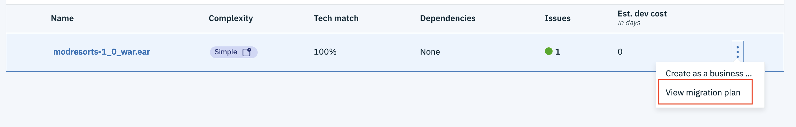
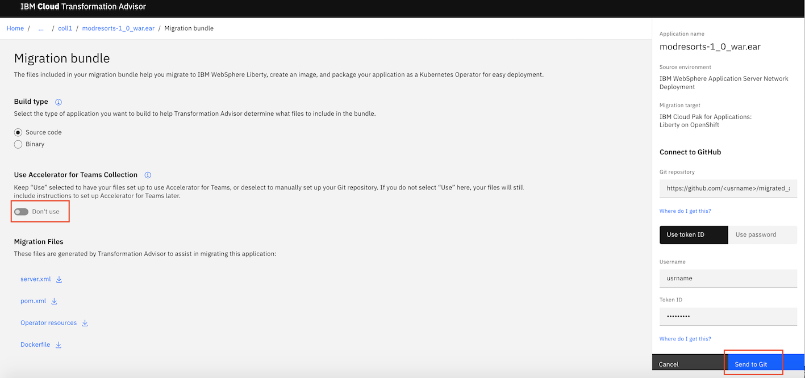
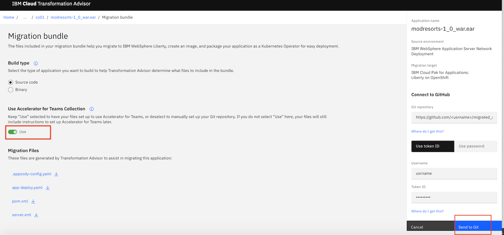
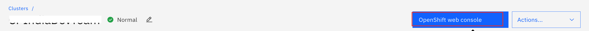

# Transform your traditional on-premises app and deploy it as a containerized app on onPrem

In this code pattern, we will use Transformation Advisor on IBM Cloud Pak for Applications to evaluate an on-premises traditional WebSphere application. traditional was bundle to deploy that app in a Liberty container running on IBM Cloud Pak for Applications running on onPremise ICPA deployed OCP 4.4. 

A sample web app is provided to demonstrate migration from on-premises to the IBM Cloud Pak for Applications.

When the reader has completed this code pattern, they will understand how to:

* Move the modernized app to IBM Cloud Pak for Applications on IBM managed OpenShift Cluster using a generated migration bundle

## Flow


1. Developer uses Docker to build an image and upload it to OpenShift Docker Registry
2. Developer creates an app using the pushed image and runs the containerized app


## Pre-requisites

* OCP 4.4
* ICPA 4.2.1
* [OpenShift CLI]
* [Docker](https://www.docker.com/)

## Steps

1. [Install IBM Cloud Pak for Applications](#1-install-ibm-cloud-pak-for-applications)
2. [Deploy your application on ICP4A](#7-deploy-your-application-on-icp4a)

## 1. Install IBM Cloud Pak for Applications

Please refer to articles on internet to install IBM Cloud Pak for Applications.


### Create a GitHub repo

Login to [GitHub](https://github.com). Create a new repository `migrated-app`.

On the TA console, now select `View migration plan` for the application you wish to migrate.



It will show you the `Migration Bundle`. If you wish to use the "Accelerator for Teams Collection" skip the next section.

### 1.1 Build the bundle without Accelerator for Teams Collection

In the `Migration bundle` screen, un-select the `Use the Accelerator for Teams Collection` option. Enter the url of the GitHub repo `migrated-app` we created earlier for `Git repository`. Enter  the `username` and `password` for the GitHub repo, and click `Send to Git` button.




Transformation Advisor will automatically populate the artifacts you need to get your application deployed and running in a Liberty container on OpenShift Cluster, including...

* server.xml 
* pom.xml
* Dockerfile
* Operator Resources


### 1.2 Build the bundle with Accelerator for Teams Collection

In the `Migration bundle` screen, un-select the `Use the Accelerator for Teams Collection` option. Enter the url of the GitHub repo `migrated-app` we created earlier for `Git repository`. Enter  the `username` and `password` for the GitHub repo, and click `Send to Git` button.




Transformation Advisor will automatically populate the artifacts you need to get your application deployed and running in a Liberty container on OpenShift Cluster, including...

* appsody-config.yaml
* app-deploy.yaml
* pom.xml
* server.xml

### 1.3 Add sources to the migration bundle

Clone this repo by running the below command:
 ```
 git clone https://github.com/sagh0900/migrate-app-to-openshift-using-cp4a/
 ```
This creates a folder `migrate-app-to-openshift-using-cp4a` with all the contents from the repo.

Clone the `migrated-app` repo you created earlier in your GitHub account:
 ```
 git clone https://github.com/<username>/migrated-app
 ```
This creates a folder `migrated-app` with all the contents from the repo.

Let us now copy the sources and dependencies to the `migrated-app` folder:
- Copy and merge the contents of folder `migrate-app-to-openshift-using-cp4a/src` to `migrated_app/src` folder. 
- Copy and merge the contents from the folder `migrate-app-to-openshift-using-cp4a/WebContent` to `migrated_app/src/main/webapp`.
- Copy the file pom.xml from `migrate-app-to-openshift-using-cp4a` to `migrated-app`. It will replace the `pom.xml` that is under `migrated_app`. Modify the configuration for the maven-war-plugin in the pom.xml as shown below:
  ```
        <plugin>
          <groupId>org.apache.maven.plugins</groupId>
          <artifactId>maven-war-plugin</artifactId>
          <version>2.6</version>
          <configuration>
            <failOnMissingWebXml>false</failOnMissingWebXml>
            <packagingExcludes>pom.xml</packagingExcludes>
            <outputDirectory>target</outputDirectory>
          </configuration>
        </plugin>
  ```
- Modify the file location attribute of the application tag in the file `migrated_app/src/main/liberty/config/server.xml` as shown below:
  ```
  <application id="modresorts" location="modresorts-1.0.war" name="modresorts-1_0_war" type="war"/>
  ```

Run the below commands to push the sourcs to the `migrated-app` GitHub repo.
 ```
 git add *
 git commit -m "Add source code files"
 git push
 ```

Now the migration bundle is complete, and is ready to be deployed on IBM Cloud Pak for Applications.


## 7. Deploy your application on ICP4A

If you are using the "Accelerator for Teams Collection" skip the next section.

### 7.1 Deploy without Accelerator for Teams Collection

***Login to IBM Managed OpenShift Cluster using CLI***

Go to `IBM Cloud Dashboard > Clusters > Click on your OpenShift Cluster > OpenShift web console` as shown.



On web console, click the menu in the upper right corner (the label contains your email address), and select Copy Login Command. Click on Display token, copy the login command and paste the command into your terminal window. 

```
   $ oc login --token=xxxx --server=https://xxxx.containers.cloud.ibm.com:xxx
   
   # Create a new project to run your application
   $ oc new-project <project-name>
```

 #### Deploy the app using Github repo
 
 Run the following commands to create an application using the Github repository and to expose it as a service.
 
 ```
   $ oc new-app <github-repo-url> --name=modapp  ## wait for this command to complete
   
   $ oc status ## to check the status of the previous command and wait till it says "deployment #1 deployed..."
   
   $ oc expose svc/modapp  ## this command exposes service after creating app 
   
   # Verify the pods and services
   $ oc get pods       ## it will show a pod running with modapp-openshift-** name
   $ oc get services   ## it will show a service running with modapp-openshift name
 ```

### 7.2 Deploy with Accelerator for Teams Collection

Refer to sections [section 8](https://github.com/IBM/build-deploy-cloud-native-application-using-cp4a#8-create-token-for-your-github) and [section 9](https://github.com/IBM/build-deploy-cloud-native-application-using-cp4a#9-configure-and-execute-tekton-pipeline) to configure and execute a `Tekton` pipeline to deploy the application.


### 7.3 Access the migrated app

   To access the migrated app on OpenShift, get the URL of the app from OpenShift web console.
   
   `OpenShift Web Console > <Go to your project>`
   
   Or run the following command to get the route of your deployed application.
   
   ```
   $ oc get routes <namespace-name>
   ```
   
   Open the noted url by adding the "/resorts" context path to see the below page:
   


## Learn More

* [Build a secure microservices based banking application](https://developer.ibm.com/patterns/build-a-secure-microservices-based-application-with-transactional-flows/)
* [Java EE Application Modernization with OpenShift](https://developer.ibm.com/patterns/jee-app-modernization-with-openshift/)
* [Learn more about IBM Cloud Pak for Application](https://developer.ibm.com/series/ibm-cloud-pak-for-applications-video-series/)
* [More about Transformation Advisor](https://www.ibm.com/support/knowledgecenter/SS5Q6W/welcome.html)

<!-- keep this -->
## License

This code pattern is licensed under the Apache Software License, Version 2. Separate third-party code objects invoked within this code pattern are licensed by their respective providers pursuant to their own separate licenses. Contributions are subject to the [Developer Certificate of Origin, Version 1.1 (DCO)](https://developercertificate.org/) and the [Apache Software License, Version 2](https://www.apache.org/licenses/LICENSE-2.0.txt).

[Apache Software License (ASL) FAQ](https://www.apache.org/foundation/license-faq.html#WhatDoesItMEAN)


